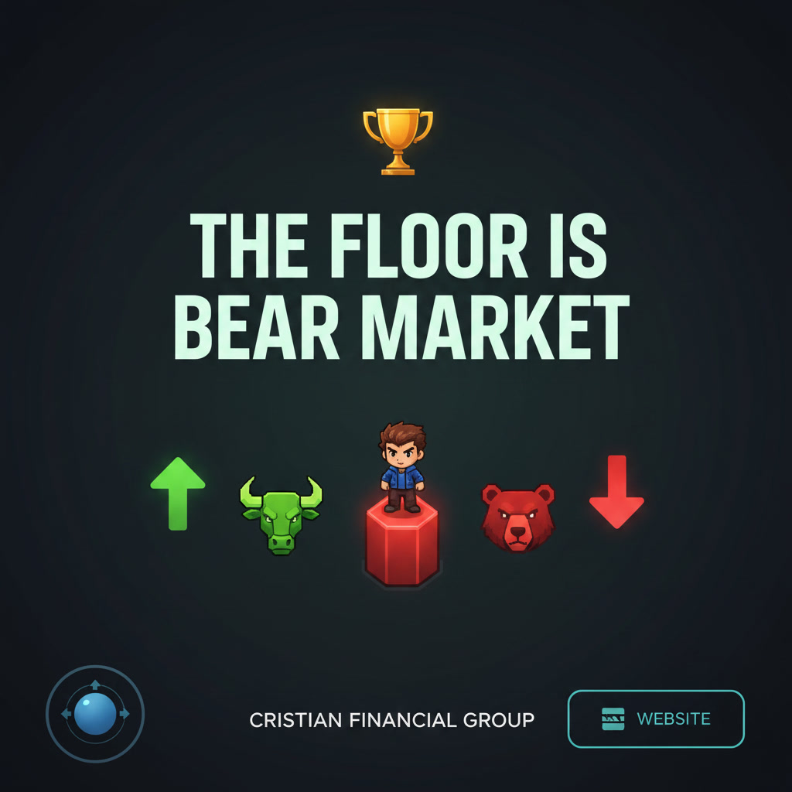

# Crash Market Survivor / Cristian Financial Group


Plataforma web de educação financeira com site institucional, aulas em vídeo, interações de aprendizagem, um jogo 2D arcade chamado **The Floor is Bear Market** e uma experiência **Unity WebGL** publicada em `/unity-game/`.

O projeto foi preparado como entrega publicável: a home apresenta a proposta da Cristian Financial Group, o jogo 2D roda em `/game/`, o jogo Unity roda em `/unity-game/`, as rotas antigas possuem compatibilidade e a configuração do Firebase Hosting já está pronta para preview e deploy.



## O Que Chama Atenção

- **Site e jogo no mesmo produto:** a experiência une conteúdo educacional, vídeos, dicas financeiras e simulação gamificada.
- **PixiJS como destaque técnico:** o jogo usa PixiJS para renderizar uma arena 2D em canvas, com loop de jogo, animação, colisão, HUD e personagens controlados por IA.
- **Unity WebGL integrado:** o site inclui uma página dedicada para o build Unity, com container responsivo, foco automático no canvas e headers WebGL configurados no Firebase Hosting.
- **Home interativa:** benefícios clicáveis, carrossel de vídeos com filtros, dicas navegáveis, modais e formulário com validação local.
- **Jogo com leitura de mercado:** velas verdes, vermelhas e neutras mudam dinamicamente, criando uma metáfora visual para risco, volatilidade e tomada de decisão.
- **Deploy pronto para Firebase:** o repositório inclui `firebase.json`, scripts NPM, página 404 personalizada e guia de publicação.
- **Compatibilidade de rotas:** caminhos antigos como `/Crash_Market_Survivor/index.html`, `/jogo/` e `game/jogo.html` direcionam o usuário para `/game/`.

## Principais Funcionalidades

- Landing page responsiva para educação financeira e mercado de ações.
- Navegação sticky com menu mobile.
- Seção de benefícios com cards interativos e conteúdo dinâmico.
- Biblioteca de vídeos locais com filtros por tema.
- Modal para assistir vídeos em destaque.
- Seção do jogo com preview, ranking local e chamada para jogar.
- Botão **UNITY GAME** no menu principal apontando para `/unity-game/`.
- Página Unity WebGL com suporte a `WASD`, `Espaço` e `Shift`.
- Newsletter com validação client-side.
- Página `404.html` personalizada.
- Jogo 2D publicado em `/game/`.
- Jogo Unity WebGL publicado em `/unity-game/`.

## O Jogo

**The Floor is Bear Market** é um jogo arcade 2D em que o jogador precisa sobreviver a um pregão volátil.

No jogo, o usuário controla um trader em uma arena de velas. As velas verdes impulsionam oportunidades, as vermelhas punem exposição ao risco e bots de IA competem pelo espaço no gráfico.

Recursos do jogo:

- Renderização 2D com **PixiJS 7.4.2**.
- Canvas responsivo com `PIXI.Application`.
- Loop de jogo baseado no `ticker` do PixiJS.
- Controles por `WASD`, setas, `Espaço` e `Shift`.
- Sistema de pulo, dash, colisão e física vertical.
- Bots de IA com tomada de alvo baseada em velas mais favoráveis.
- Ondas de mercado com fases como rali, correção técnica e stop em cadeia.
- HUD com tempo, patrimônio, posição e recorde local.
- Persistência do recorde via `localStorage`.
- Tela inicial, tela de resultado e reinício de rodada.

## Unity WebGL

A rota `/unity-game/` carrega o build Unity WebGL **CrashMarketSurvivorWeb** em uma página dedicada, separada do jogo 2D em PixiJS.

Recursos da integração Unity:

- Build isolado em `stock-markets-site/unity-game/`.
- Arquivos Unity WebGL em `unity-game/Build/`.
- Assets do template Unity em `unity-game/TemplateData/`.
- Canvas centralizado e responsivo.
- Foco automático no jogo para capturar teclado.
- Dica inferior indicando que o jogador deve segurar `Shift` para correr dos zumbis.
- Headers de `Content-Type` configurados para arquivos WebGL no Firebase Hosting, com suporte mantido para builds `.br` e `.gz` caso a compressão seja reativada no Unity.

## Tecnologias Usadas

| Camada | Tecnologias |
| --- | --- |
| Estrutura | HTML5 |
| Estilo | CSS3, layout responsivo, media queries |
| Interatividade | JavaScript vanilla |
| Jogo 2D | **PixiJS**, Canvas, game loop, sprites desenhados por código |
| Jogo Unity | **Unity WebGL**, Canvas, WASM |
| Persistência local | `localStorage` |
| Mídia | PNG, MP4, favicon |
| Hospedagem | Firebase Hosting |
| Automação | NPM scripts com Firebase CLI |

## Estrutura Do Projeto

```text
.
|-- firebase.json
|-- package.json
|-- FIREBASE_HOSTING.md
|-- README.md
|-- stock-markets-site/
|   |-- index.html
|   |-- style2.css
|   |-- script.js
|   |-- 404.html
|   |-- favicon/
|   |-- imagens/
|   |-- videos/
|   |-- game/
|   |   |-- index.html
|   |   |-- jogo.html
|   |   |-- game.css
|   |   |-- game.js
|   |   |-- assets/
|   |-- unity-game/
|   |   |-- index.html
|   |   |-- unity-game.css
|   |   |-- unity-game.js
|   |   |-- Build/
|   |   |-- TemplateData/
|   |-- jogo/
|   |-- Crash_Market_Survivor/
|-- docs/
```

## Rotas Publicadas

| Rota | Conteúdo |
| --- | --- |
| `/` | Home do site |
| `/game/` | Jogo The Floor is Bear Market |
| `/unity-game/` | Jogo Unity WebGL Crash Market Survivor |
| `/game/jogo.html` | Compatibilidade para abrir o jogo |
| `/jogo/` | Compatibilidade para abrir o jogo |
| `/Crash_Market_Survivor/index.html` | Compatibilidade com caminho antigo |
| `/404.html` | Página de erro personalizada |

## Como Rodar Localmente

Instale ou use a Firebase CLI via `npx` e rode o emulador:

```powershell
npm run firebase:serve
```

Depois acesse:

```text
http://127.0.0.1:5000/
http://127.0.0.1:5000/game/
http://127.0.0.1:5000/unity-game/
```

## Deploy No Firebase Hosting

O diretório público configurado é `stock-markets-site`.

```powershell
npm run firebase:login
npm run firebase:use
npm run firebase:preview
npm run firebase:deploy
```

O guia completo está em [FIREBASE_HOSTING.md](FIREBASE_HOSTING.md).

## Observações Técnicas

- O jogo carrega PixiJS por CDN:

```html
https://cdn.jsdelivr.net/npm/pixi.js@7.4.2/dist/pixi.min.js
```

- Para deixar o jogo totalmente independente de CDN, basta baixar o PixiJS minificado para uma pasta local, por exemplo `stock-markets-site/game/vendor/`, e alterar o `<script>` do jogo.
- O build Unity WebGL atual usa arquivos sem compressão prévia (`.data`, `.framework.js` e `.wasm`) para evitar erros de decompression no Firebase Hosting. O `firebase.json` mantém headers para `.br` e `.gz` caso a compressão seja reativada no Unity.
- Os vídeos locais somam mais de 260 MB. Para alto tráfego, pode valer migrar os vídeos para YouTube, Vimeo, Cloud Storage ou uma CDN dedicada.

## Status

Projeto preparado para publicação no Firebase Hosting, com home, jogo 2D, jogo Unity WebGL, assets, rotas de compatibilidade, scripts de deploy e documentação de entrega.
